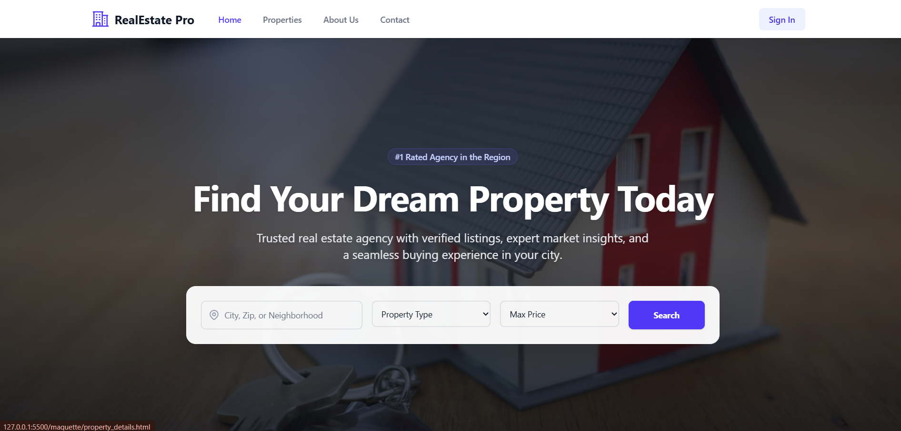
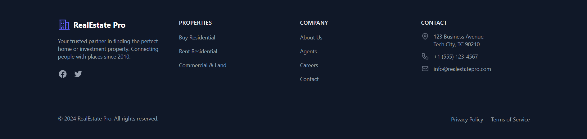
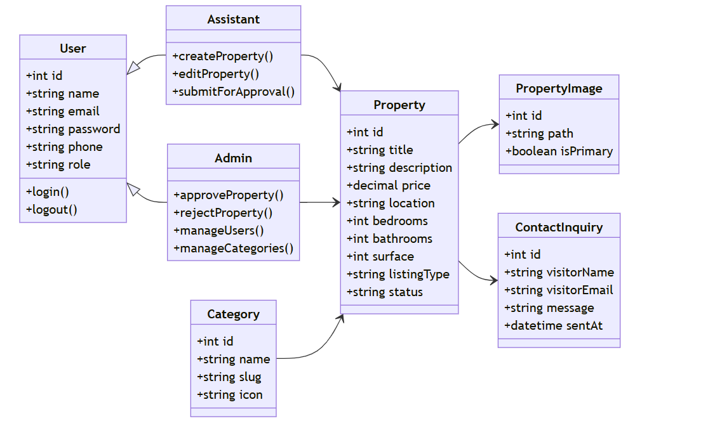
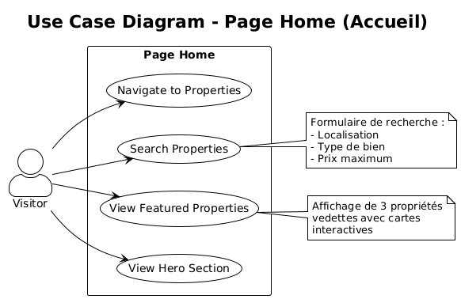

🏠 Système d'Annonces Immobilières

**🚀 Sprint 1 : Visiteur & Découverte**

- **Présenté par :** Adnane Kesksu
- **Encadré par :** Mr. ESSARRAJ Fouad

## Introduction et Contexte Général

Le projet RealEstate Pro est une plateforme web moderne conçue pour la gestion professionnelle d'annonces immobilières. Elle permet de centraliser les offres, d'assurer la qualité des données et de faciliter la mise en relation entre agents et acquéreurs.

- La problématique : La gestion manuelle ou via des réseaux sociaux manque de rigueur (validation des données), de recherche avancée (filtres précis) et de suivi efficace des demandes de contact.

- La solution : Un système robuste avec un workflow d'approbation administrateur, une recherche multicritères intuitive et une interface responsive pour une expérience utilisateur premium.

## Analyse des Besoins

1. **Gestion de Qualité** : Toutes les annonces doivent être approuvées par un admin avant publication.

2. **Accessibilité Publique** : Recherche avancée (prix, ville, type de bien, chambres).

3. **Conversion Client** : Formulaires de contact directs liés aux propriétés spécifiques.

4. **Rôles & Sécurité** : Distinction claire entre Admin (supervision), Assistant (création) et Visiteur (consultation).

## méthodologie de travail

### Méthode Scrum

- Sprint 1 : Portail Public & Recherche.

### Méthode Recherche & Inspiration

Analyse de plateformes existantes :

- **PropertyFinder**
- **Avito Immobilier**
- **Leboncoin Immobilier**

# Objectif : Adopter les meilleures pratiques UX/UI tout en gardant une solution simple et efficace.

### Détails du Sprint 1 : Portail Web Public

Ce premier sprint se concentre sur l'expérience du visiteur anonyme (le futur acquéreur).

**Fonctionnalités clés :**

- **Moteur de Recherche :** Filtrage par prix, localisation et type de bien.

- **Galerie de Propriétés :** Affichage optimisé des annonces actives.

- **Page de Détails :** Vue immersive avec photos haute résolution et caractéristiques techniques.

- **Inquiry System :** Formulaire "Contactez-nous à propos de ce bien".

## 📌 Travail à Faire

Focus Principal : Développement du Portail Public

 **Réalisation de la Page "Home Page" :** Développement complet de la fiche produit intégrant :

- Hero with search form
- Featured properties preview
- CTA section

## Lab 

- Php ini config (deploy)

### Maquettes et Tests Utilisateurs

- **Maquette clé** : Page `Home` avec UX moderne.
- Outils : Tailwind CSS (4)

## Diagramme de Classes

Structure de la base de données et relations entre les entités :

## Diagramme de cas d'utilisation

Le flux utilisateur suit le diagramme de cas d'utilisation conçu pour ce sprint :

- **Acteurs :** Visiteur / Public.

### **Fonctionnalités Détaillées :**

## Sections de la Page d'Accueil

### 1. Hero Section Immersif
* Affichage d'une image de fond plein écran avec effet parallax
* Animation de zoom subtile au survol
* Badge de distinction (#1 Rated Agency)
* Formulaire de recherche avancée intégré (Localisation, Type, Prix)

### 2. Section Propriétés en Vedette
* Affichage de 3 propriétés phares en grille responsive
* Cartes avec :
   * Image avec zoom au survol
   * Badge de statut (For Sale, New, For Rent)
   * Prix, localisation, chambres/salles de bain
* Lien vers la liste complète

### 3. Footer Complet
* Logo et description de l'agence
* Liens de navigation organisés en colonnes
* Informations de contact avec icônes
* Liens réseaux sociaux

## 🔧 Réalisation Technique Approfondie

### Back-End et Architecture

**Framework** : Laravel 12

**Architecture N-Tiers** :
* **Controller** : Gestion des requêtes HTTP
* **Model** : Interaction avec la base de données

**Avantages** : 
* Scalabilité optimale
* Testabilité facilitée
* Maintenance simplifiée

---

### Front-End

* **Blade** : Templates réutilisables (components, layouts)
* **Tailwind CSS** : Développement rapide et responsive
* **Preline UI** : Composants UI pré-intégrés
* **Lucide** : Bibliothèque d'icônes modernes

---

### Gestion de Projet

* **GitHub** : Versionning et gestion des branches
* **Git Flow** : Workflow de développement structuré

## Conclusion 
- Sprint 1 : Le Sprint 1 de **RealEstate Pro** a posé les fondations d'une plateforme immobilière de nouvelle génération. Grâce à une architecture N-Tiers scalable, une interface utilisateur moderne et responsive, et un système de gestion d'annonces optimisé, la solution répond parfaitement aux exigences du marché tout en offrant une expérience utilisateur exceptionnelle.

### Résultats clés :

- Page **Home** complète et fonctionnelle avec tous les composants essentiels

- **Hero Section** immersive avec image de fond animée et recherche intégrée

- **Formulaire de recherche** avancée (localisation, type, prix)

- **Interface frontend** moderne avec Tailwind CSS 4

